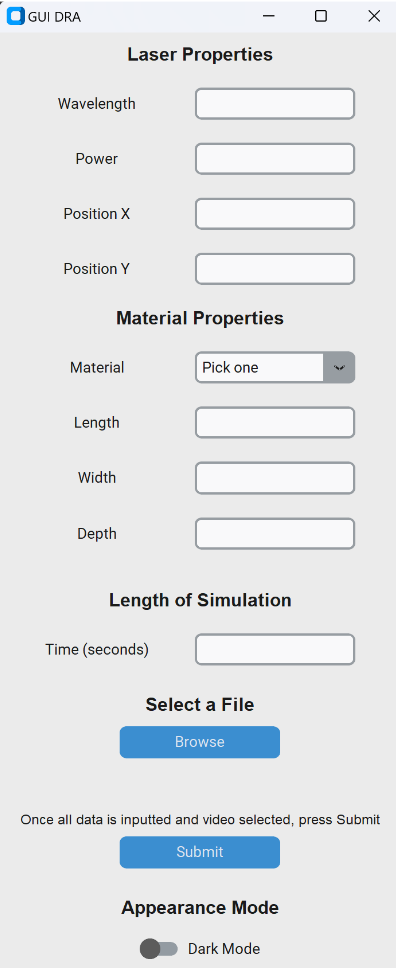
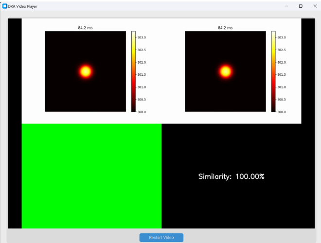
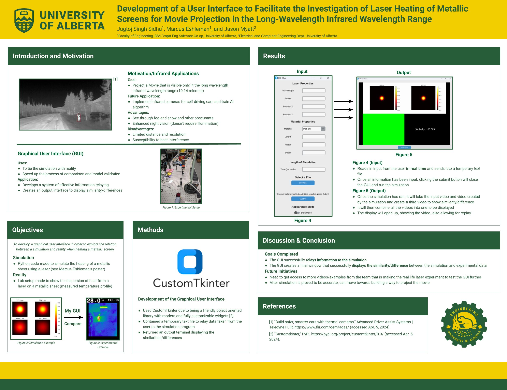

# Development of a User Interface for Investigating Laser Heating of Metallic Screens in the Long-Wavelength Infrared Range

## Project Overview
This project was completed as part of the Dean's Research Awards (DRA) at the University of Alberta. It involved developing a comprehensive user interface (GUI) for simulating and investigating laser heating on metallic screens, with potential applications in long-wavelength infrared movie projection. The GUI allows users to input parameters, control the laser simulation, and compare the simulated output with real video data. It produces a video that highlights pixel-by-pixel similarities and differences, aiding in model validation and comparison between simulated and real-world data.

As part of the DRA, this project culminated in a presentation, where I shared the findings and demonstrated the software’s capabilities.

## Features
- **Graphical User Interface**: Uses CustomTkinter to provide an intuitive, interactive GUI for setting up and controlling the simulation.
- **Simulation Control**: Configures and runs the laser heating simulation based on user-defined parameters like laser properties and material characteristics.
- **Video Comparison**: Generates a similarity video that displays identical pixels in green and differing pixels in red, providing a clear comparison of the simulation against actual video input.
- **Video Merging**: Combines the input video, simulated output, and similarity video into a single composite display for convenient viewing and analysis.

## Usage
1. **Input Parameters**: Use the GUI to define laser properties (e.g., wavelength, power) and select material characteristics.
2. **Select Comparison Video**: Browse and choose a real video to compare with the simulation output.
3. **Run Simulation**: Click **Submit** in the GUI to start the simulation, which will output a video comparing the input and simulated data.
4. **View Results**: The final output includes merged videos and a similarity video that highlights pixel matches and mismatches.

## Example Output

- Screenshot of the GUI interface with user input options.

- Example output of the merged video showing similarity with green pixels for identical areas and red pixels for differences.

## Dean’s Research Awards Presentation

- This project was presented as part of the Dean’s Research Awards. The presentation covered the project’s goals, methods, and potential applications in infrared technology.

## Credits
- **Dr. Jason Myatt**, Professor at the University of Alberta, for guidance and project support.
- **Marcus Eshleman**, for developing the laser heating simulation integrated within this interface.
